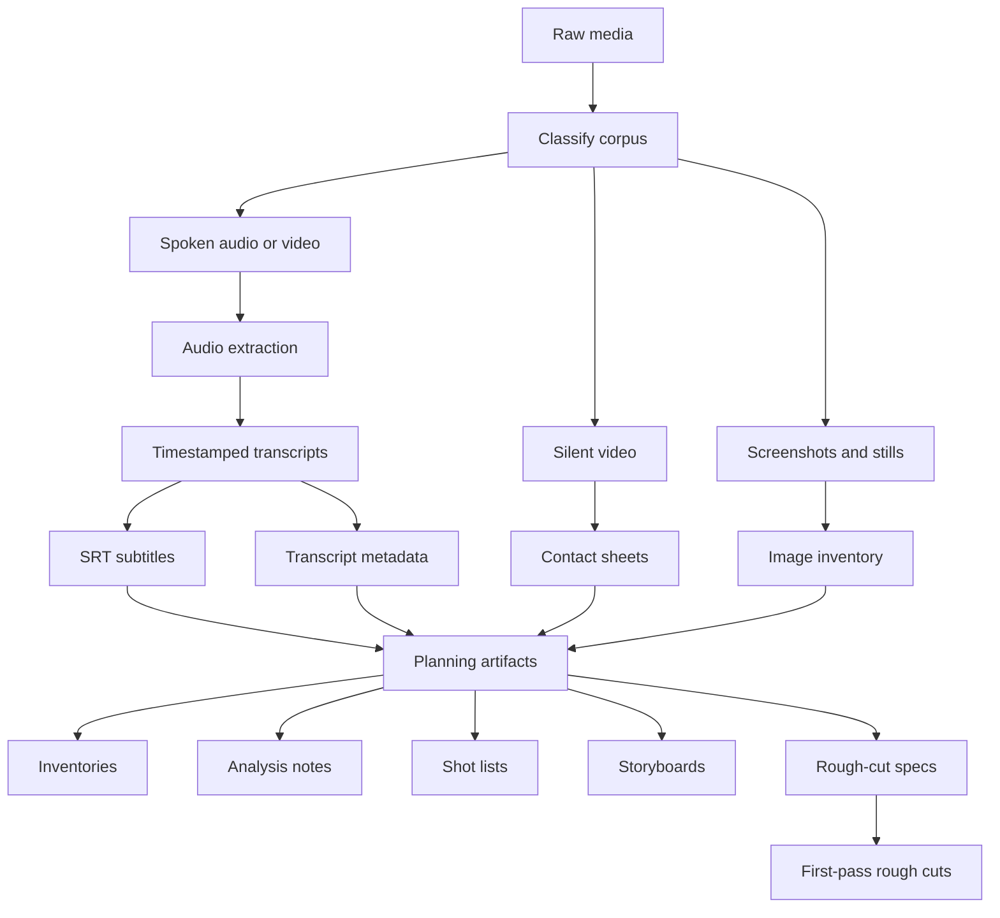

# Media Tooling

Media Tooling helps an agent harness turn raw media into planning and editing artifacts while keeping the user centered in the project workspace.

User-facing execution context lives in a project-local `AGENTS.md` generated by `media-tooling-init`. The repo-root [`AGENTS.md`](./AGENTS.md) is intentionally minimal and only supports toolkit development. Developer-only maintenance notes and quality gates live in [`docs/DEVELOPMENT.md`](./docs/DEVELOPMENT.md).

## What it does

Media Tooling helps convert raw source material into planning and production context.

At a high level, it processes raw videos and audio to produce timestamped transcripts for spoken material and frame captures for visual material. Those processed artifacts are then used to analyze what the source media contains and turn that understanding into production artifacts such as inventories, shot lists, storyboards, rough-cut specs, and first-pass rough cuts.

Media Tooling gives an agent harness a repeatable media-processing pipeline:

1. Extract audio from spoken video when needed.
2. Generate timestamped transcripts from spoken audio or video.
3. Produce `.srt` subtitles and structured transcript metadata.
4. Generate contact sheets for silent screen recordings and visual demos.
5. Turn those processed assets into planning artifacts.
6. Assemble first-pass rough cuts from reusable project-local specs.

The main artifacts it produces are:

- transcripts for spoken audio and video
- `.srt` subtitles
- contact sheets for silent screen recordings and demos
- inventories
- analysis notes
- shot lists
- storyboards
- rough-cut specs
- first-pass rough cuts

A "rough cut" is a fast first-pass assembly used to validate structure, pacing, sequencing, and missing material before manual editing.

A "contact sheet" is a single image made from several frames sampled across a video so you can inspect its visual progression quickly without scrubbing through the whole file.



It fits podcasts, interviews, tutorials, courses, product videos, shorts, reels, and YouTube uploads.

Transcription uses a platform-appropriate backend:

- Apple Silicon macOS: `lightning-whisper-mlx`
- other workstations: `faster-whisper`

For MLX runs, `media-subtitle` now performs a timestamp sanity check after transcription. It probes the media duration and compares it to the transcript's last segment end time. If the duration is near the observed `10x` MLX compression pattern, the toolkit auto-corrects the timestamps and records the correction details in the JSON metadata.

## Quick start

Install the commands once, then bootstrap each project workspace:

```bash
brew install uv ffmpeg
uv tool install git+https://github.com/kumanday/media-tooling

export PROJECT_DIR="$HOME/projects/my-project-media"
media-tooling-init "$PROJECT_DIR"
cd "$PROJECT_DIR"
```

`media-tooling-init` creates the standard project directories and writes a minimal project-local `AGENTS.md` block that points at the centrally installed media-tooling skills. If `AGENTS.md` already exists, the command updates only its managed block instead of clobbering the file.

If you prefer ad hoc execution instead of a persistent tool install, run the same bootstrap with `uvx`:

```bash
uvx --from git+https://github.com/kumanday/media-tooling media-tooling-init "$PROJECT_DIR"
```

For private access or SSH-based installs, use `git+ssh://git@github.com/kumanday/media-tooling`.

## Primary workflow

The usual workflow is prompt-driven. Install the toolkit once, create a project workspace, and keep the agent harness focused on `$PROJECT_DIR`. The generated project `AGENTS.md` points the harness at the centrally installed skills and commands while project artifacts stay local to the workspace.

Typical flow:

1. Install the toolkit commands once with `uv tool install`.
2. Run `media-tooling-init` for each project workspace.
3. Put raw media and project outputs in `$PROJECT_DIR`.
4. Ask the harness to ingest the corpus, process the media, and produce planning artifacts.

## Workflow layers

The toolkit works through three layers:

- project-local `AGENTS.md`
  `media-tooling-init` writes the persistent execution context into the project workspace instead of the toolkit repository.
- central toolkit skills
  The project `AGENTS.md` points at the installed skill files under `.agents/skills/`. The main skills are [`media-corpus-ingest`](./.agents/skills/media-corpus-ingest/SKILL.md), [`media-subtitle-pipeline`](./.agents/skills/media-subtitle-pipeline/SKILL.md), and [`media-rough-cut-assembly`](./.agents/skills/media-rough-cut-assembly/SKILL.md).
- toolkit commands
  Installed `media-*` commands extract audio, generate transcripts and subtitles, build contact sheets, initialize projects, or assemble rough cuts.

## Prompt patterns

These prompt patterns are the main entry point for the toolkit.

Prompt for outcomes, not for toolkit internals. The skills and commands are there to handle classification, batching, extraction, and assembly.

### High-level directives

These short, outcome-oriented prompts are the main use case.

```text
Create a 5-minute highlight reel with representative samples of the different speakers and the topics discussed.
```

```text
Turn this session into a short recap that explains the main workflows, tools, and takeaways.
```

```text
Review this processed media project and propose a first-pass rough cut with the strongest clips and any obvious weak spots.
```

### More explicit workflow prompts

Use these when you want to be more specific about the inputs or deliverables.

#### Ingest a mixed corpus

```text
I have a new media project in $PROJECT_DIR.

Source folders:
- spoken videos: /path/to/spoken
- silent screen recordings: /path/to/silent
- screenshots: /path/to/images

Please process this source material and leave me with:
- transcripts and subtitles for the spoken material
- contact sheets for the silent recordings
- a clean inventory of what is in the project
- short analysis notes I can use for planning
```

#### Build a shot list after ingestion

```text
The corpus has already been processed in $PROJECT_DIR.

Please review what is already there and give me:
- a shortlist of the strongest clips
- a shot list with timestamps, durations, and editorial purpose
- a note on what still needs to be recorded
```

#### Prepare a rough cut

```text
Please use the processed artifacts in $PROJECT_DIR to propose a first-pass rough cut.

I want:
- a recommended sequence
- notes on where narration should carry the section
- notes on where silent clips or screenshots are enough
- a short list of weak sections that still need new material
```

#### Build a rough cut from a project spec

```text
The storyboard and clip selections in $PROJECT_DIR are approved.

Please turn them into a first-pass rough cut with readable placeholder cards for anything that still needs to be recorded.
```

More prompt patterns live in [`docs/WORKFLOWS.md`](./docs/WORKFLOWS.md).

## Skills and commands

Most users will work through prompts. The project-local `AGENTS.md` routes those prompts to the central skills, and the skills translate them into the command-line steps below.

The main skills are:

- [`media-corpus-ingest`](./.agents/skills/media-corpus-ingest/SKILL.md)
  Uses the subtitle and contact-sheet commands to ingest a mixed media corpus into a project workspace.
- [`media-subtitle-pipeline`](./.agents/skills/media-subtitle-pipeline/SKILL.md)
  Uses the subtitle commands for spoken-media processing.
- [`media-rough-cut-assembly`](./.agents/skills/media-rough-cut-assembly/SKILL.md)
  Uses a project-local JSON spec to assemble cards, image holds, extracted clips, manifests, and first-pass rough cuts.

The underlying commands are:

- `media-subtitle`
  Generate transcript `.txt`, subtitle `.srt`, and structured `.json` from a single audio or video file.
- `media-batch-subtitle`
  Process a manifest of spoken-media files sequentially.
- `media-contact-sheet`
  Generate a contact sheet from a single silent or visual-first video.
- `media-batch-contact-sheet`
  Process a manifest of silent or visual-only videos sequentially.
- `media-rough-cut`
  Build a first-pass rough cut from a project-local JSON spec of cards, image holds, and clip extracts.
- `media-tooling-init`
  Create the standard project directories and write or refresh the managed `AGENTS.md` block for a media project workspace.

Optional shell helpers for repo-checkout workflows:

- `extract`
- `subtitle`

Both subtitle commands accept `--backend auto|mlx|faster-whisper`.

If you need the raw backend timestamps for debugging, pass `--disable-timestamp-correction`.

If you want direct command examples, see [`docs/WORKFLOWS.md`](./docs/WORKFLOWS.md).

## Project boundaries

Keep reusable code and installs outside the project workspace. Keep project outputs in a separate workspace.

Typical setup:

- toolkit install: `uv tool install git+https://github.com/kumanday/media-tooling`
- project workspace: `$HOME/projects/my-project-media`

This repository also creates a few local-only directories during normal use:

- `.venv/` for the local Python environment
- cache directories for downloaded packages and local runtime data

Those directories are generated on demand, safe to delete, and ignored by Git.

## Documentation

- [`docs/SETUP.md`](./docs/SETUP.md)
- [`docs/WORKFLOWS.md`](./docs/WORKFLOWS.md)
- [`docs/EXPORTING.md`](./docs/EXPORTING.md)

## Toolkit skills

Central toolkit skills live in:

- [`.agents/skills/media-subtitle-pipeline/SKILL.md`](./.agents/skills/media-subtitle-pipeline/SKILL.md)
- [`.agents/skills/media-corpus-ingest/SKILL.md`](./.agents/skills/media-corpus-ingest/SKILL.md)
- [`.agents/skills/media-rough-cut-assembly/SKILL.md`](./.agents/skills/media-rough-cut-assembly/SKILL.md)
