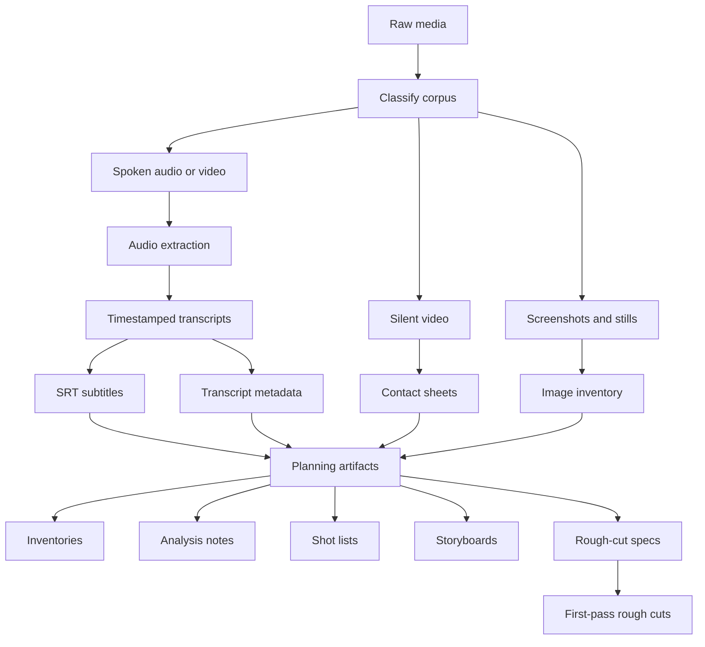

# Media Tooling

Media Tooling helps an agent harness turn raw media into planning and editing artifacts.

## What it does

Media Tooling helps convert raw source material into planning and production context.

At a high level, it processes raw videos and audio to produce timestamped transcripts for spoken material and frame captures for visual material. Those processed artifacts are then used to analyze what the source media contains and turn that understanding into production artifacts such as inventories, shot lists, storyboards, rough-cut specs, and first-pass rough cuts.

Media Tooling gives an agent harness a repeatable media-processing pipeline:

1. Extract audio from spoken video when needed.
2. Generate timestamped transcripts from spoken audio or video.
3. Produce `.srt` subtitles and structured transcript metadata.
4. Generate contact sheets for silent screen recordings and visual demos.
5. Turn those processed assets into planning artifacts.
6. Assemble first-pass rough cuts from reusable project-local specs.

The main artifacts it produces are:

- transcripts for spoken audio and video
- `.srt` subtitles
- contact sheets for silent screen recordings and demos
- inventories
- analysis notes
- shot lists
- storyboards
- rough-cut specs
- first-pass rough cuts

A "rough cut" is a fast first-pass assembly used to validate structure, pacing, sequencing, and missing material before manual editing.

A "contact sheet" is a single image made from several frames sampled across a video so you can inspect its visual progression quickly without scrubbing through the whole file.



It fits podcasts, interviews, tutorials, courses, product videos, shorts, reels, and YouTube uploads.

Transcription uses a platform-appropriate backend:

- Apple Silicon macOS: `lightning-whisper-mlx`
- other workstations: `faster-whisper`

## Quick start

Clone the repository and run the macOS bootstrap script:

```bash
git clone https://github.com/kumanday/media-tooling "$HOME/dev/media-tooling"
cd "$HOME/dev/media-tooling"
./scripts/bootstrap-macos.sh
```

That installs `uv`, `ffmpeg`, Python 3.12, the local environment, and the `extract` and `subtitle` shell helpers.

Create a separate project workspace for each production:

```bash
export TOOLKIT_DIR="$HOME/dev/media-tooling"
export PROJECT_DIR="$HOME/projects/my-project-media"

mkdir -p "$PROJECT_DIR"/{assets/audio,assets/reference,transcripts,subtitles,inventory,analysis,storyboards,rough-cuts}
```

## Primary workflow

The usual workflow is prompt-driven. You give an agent harness the toolkit, a project workspace, and a source corpus. The harness uses the skills and commands under the hood and writes project artifacts into the project workspace.

Typical flow:

1. Put the toolkit in `$TOOLKIT_DIR`.
2. Put project-specific outputs in `$PROJECT_DIR`.
3. Point the harness at the raw media folders.
4. Ask it to ingest the corpus, process the media, and produce planning artifacts.

## Workflow layers

The toolkit works through three layers:

- prompts
  You describe the source material, the output you want, and any constraints such as sequential processing.
- skills
  The harness uses toolkit-local skills to decide which processing path fits the corpus. The main skills are [`media-corpus-ingest`](./.agents/skills/media-corpus-ingest/SKILL.md), [`media-subtitle-pipeline`](./.agents/skills/media-subtitle-pipeline/SKILL.md), and [`media-rough-cut-assembly`](./.agents/skills/media-rough-cut-assembly/SKILL.md).
- toolkit commands
  The skills call the command-line tools that extract audio, generate transcripts and subtitles, build contact sheets, or assemble rough cuts.

## Prompt patterns

These prompt patterns are the main entry point for the toolkit.

Prompt for outcomes, not for toolkit internals. The skills and commands are there to handle classification, batching, extraction, and assembly.

### Ingest a mixed corpus

```text
I have a new media project in $PROJECT_DIR.

Source folders:
- spoken videos: /path/to/spoken
- silent screen recordings: /path/to/silent
- screenshots: /path/to/images

Please process this source material and leave me with:
- transcripts and subtitles for the spoken material
- contact sheets for the silent recordings
- a clean inventory of what is in the project
- short analysis notes I can use for planning
```

### Build a shot list after ingestion

```text
The corpus has already been processed in $PROJECT_DIR.

Please review what is already there and give me:
- a shortlist of the strongest clips
- a shot list with timestamps, durations, and editorial purpose
- a note on what still needs to be recorded
```

### Prepare a rough cut

```text
Please use the processed artifacts in $PROJECT_DIR to propose a first-pass rough cut.

I want:
- a recommended sequence
- notes on where narration should carry the section
- notes on where silent clips or screenshots are enough
- a short list of weak sections that still need new material
```

### Build a rough cut from a project spec

```text
The storyboard and clip selections in $PROJECT_DIR are approved.

Please turn them into a first-pass rough cut with readable placeholder cards for anything that still needs to be recorded.
```

More prompt patterns live in [`docs/WORKFLOWS.md`](./docs/WORKFLOWS.md).

## Skills and commands

Most users will work through prompts. The skills translate those prompts into the command-line steps below.

The main skills are:

- [`media-corpus-ingest`](./.agents/skills/media-corpus-ingest/SKILL.md)
  Uses the subtitle and contact-sheet commands to ingest a mixed media corpus into a project workspace.
- [`media-subtitle-pipeline`](./.agents/skills/media-subtitle-pipeline/SKILL.md)
  Uses the subtitle commands for spoken-media processing.
- [`media-rough-cut-assembly`](./.agents/skills/media-rough-cut-assembly/SKILL.md)
  Uses a project-local JSON spec to assemble cards, image holds, extracted clips, manifests, and first-pass rough cuts.

The underlying commands are:

- `media-subtitle`
  Generate transcript `.txt`, subtitle `.srt`, and structured `.json` from a single audio or video file.
- `media-batch-subtitle`
  Process a manifest of spoken-media files sequentially.
- `media-contact-sheet`
  Generate a contact sheet from a single silent or visual-first video.
- `media-batch-contact-sheet`
  Process a manifest of silent or visual-only videos sequentially.
- `media-rough-cut`
  Build a first-pass rough cut from a project-local JSON spec of cards, image holds, and clip extracts.

Shell helpers installed into `~/.zshrc`:

- `extract`
- `subtitle`

Both subtitle commands accept `--backend auto|mlx|faster-whisper`.

If you want direct command examples, see [`docs/WORKFLOWS.md`](./docs/WORKFLOWS.md).

## Project boundaries

Keep reusable code in this repository. Keep project outputs in a separate workspace.

Typical setup:

- toolkit directory: `$HOME/dev/media-tooling`
- project workspace: `$HOME/projects/my-project-media`

This repository also creates a few local-only directories during normal use:

- `.venv/` for the local Python environment
- cache directories for downloaded packages and local runtime data

Those directories are generated on demand, safe to delete, and ignored by Git.

## Documentation

- [`docs/SETUP.md`](./docs/SETUP.md)
- [`docs/WORKFLOWS.md`](./docs/WORKFLOWS.md)
- [`docs/EXPORTING.md`](./docs/EXPORTING.md)

## Toolkit skills

Toolkit-local skills live in:

- [`.agents/skills/media-subtitle-pipeline/SKILL.md`](./.agents/skills/media-subtitle-pipeline/SKILL.md)
- [`.agents/skills/media-corpus-ingest/SKILL.md`](./.agents/skills/media-corpus-ingest/SKILL.md)
- [`.agents/skills/media-rough-cut-assembly/SKILL.md`](./.agents/skills/media-rough-cut-assembly/SKILL.md)
